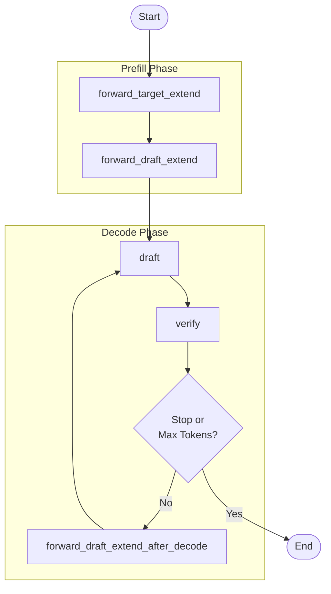

# sglang mtp 投机采样

## 实验环境
docker images: rocm/ali-private:ubuntu22.04_rocm7.2.0.43_cp310_torch2.9.1_7e1940d_sglang_6eb173f_aiter_d2f5f27_20260304

server script:
```
export HSA_NO_SCRATCH_RECLAIM=1
export SGLANG_DISABLE_CUDNN_CHECK=1
python3 -m sglang.launch_server \
        --port 8000 \
        --model-path /apps/data/models/Qwen3.5-397B-A17B \
        --tp-size 8 \
        --attention-backend triton \
        --reasoning-parser qwen3 \
        --tool-call-parser qwen3_coder \
        --speculative-algo NEXTN \
        --speculative-num-steps 3 \
        --speculative-eagle-topk 1 \
        --speculative-num-draft-tokens 4
```
其中最后4行为mtp启动参数, 参考自https://docs.sglang.io/advanced_features/speculative_decoding.html#eagle-decoding
```
        --speculative-algo NEXTN \         # 投机采样算法，NEXTN=EAGLE
        --speculative-num-steps 3 \        # draft model 自回归生成 token 个数，数值越大，单个分支生成的 token 数越多
        --speculative-eagle-topk 1 \       # draft model 的分支因子，数值越大，每次生成越多的选项
        --speculative-num-draft-tokens 4   # 最多并行验证多少 token 数
```
## 代码解读
如果开启了MTP，那么调用的worker是EAGLEWorker：https://github.com/sgl-project/sglang/blob/v0.5.9/python/sglang/srt/speculative/eagle_worker.py。

- target model: 原始Qwen3.5 model, https://github.com/sgl-project/sglang/blob/v0.5.9/python/sglang/srt/models/qwen3_5.py
- draft model: Qwen3.5 原生 mtp model, https://github.com/sgl-project/sglang/blob/v0.5.9/python/sglang/srt/models/qwen3_5_mtp.py
```
Qwen3_5ForCausalLMMTP(
  (fc): Linear(in_features=8192, out_features=4096, bias=False)
  (pre_fc_norm_embedding): GemmaRMSNorm()
  (pre_fc_norm_hidden): GemmaRMSNorm()
  (model): Qwen3_5ForCausalLM(
    (embed_tokens): VocabParallelEmbedding(num_embeddings=31040, embedding_dim=4096, org_vocab_size=248320, num_embeddings_padded=248320, tp_size=8)
    (layers): ModuleList(
      (0): Qwen3_5AttentionDecoderLayer(
        (rotary_emb): MRotaryEmbedding(head_size=256, rotary_dim=64, max_position_embeddings=262144, base=10000000, is_neox_style=True)
        (qkv_proj): QKVParallelLinear(in_features=4096, output_features=2560, bias=False, tp_size=8, gather_output=False)
        (o_proj): RowParallelLinear(input_features=1024, output_features=4096, bias=False, tp_size=8, reduce_results=False)
        (attn): RadixAttention()
        (mlp): Qwen2MoeSparseMoeBlock(
          (topk): TopK()
          (experts): FusedMoE(
            (quant_method): UnquantizedFusedMoEMethod()
          )
          (gate): ReplicatedLinear(in_features=4096, output_features=512, bias=False)
          (shared_expert): Qwen2MoeMLP(
            (gate_up_proj): MergedColumnParallelLinear(in_features=4096, output_features=256, bias=False, tp_size=8, gather_output=False)
            (down_proj): RowParallelLinear(input_features=128, output_features=4096, bias=False, tp_size=8, reduce_results=False)
            (act_fn): SiluAndMul()
          )
          (shared_expert_gate): Linear(in_features=4096, out_features=1, bias=False)
        )
        (input_layernorm): GemmaRMSNorm()
        (post_attention_layernorm): GemmaRMSNorm()
        (q_norm): GemmaRMSNorm()
        (k_norm): GemmaRMSNorm()
      )
    )
    (norm): GemmaRMSNorm()
  )
  (lm_head): ParallelLMHead(num_embeddings=31040, embedding_dim=4096, org_vocab_size=248320, num_embeddings_padded=248320, tp_size=8)
  (logits_processor): LogitsProcessor()
)
```
### mtp推理流程
启动mtp后，推理流程大致如下，包括五个主要流程
- Extend 阶段（新请求） 
  - [forward_target_extend](https://github.com/sgl-project/sglang/blob/v0.5.9/python/sglang/srt/speculative/eagle_worker.py#L357)
    - Target Model: 标准 Extend Attention
    - 处理 prompt tokens，输出 hidden states
  - [forward_draft_extend](https://github.com/sgl-project/sglang/blob/v0.5.9/python/sglang/srt/speculative/eagle_worker.py#L862)
    - Draft Model: draft_extend_attn_backend
    - 使用 Target 的 hidden states 初始化 KV cache, 准备 Draft 的初始状态
- Decode 循环（生成阶段） 
  - [draft](https://github.com/sgl-project/sglang/blob/v0.5.9/python/sglang/srt/speculative/eagle_worker.py#L532)
    - Draft: draft_attn_backend
    - 多步树形注意力，快速生成 N 步候选,**** 输出: 树形结构的候选 tokens
  - [verify](https://github.com/sgl-project/sglang/blob/v0.5.9/python/sglang/srt/speculative/eagle_worker.py#L691)
    - Target: 标准 Decode Attention（Verify）
    - 并行验证所有候选路径, 输出: 接受的 tokens + 新的 hidden states
  - [forward_draft_extend_after_decode](https://github.com/sgl-project/sglang/blob/v0.5.9/python/sglang/srt/speculative/eagle_worker.py#L902)
    - Draft: draft_extend_attn_backend（可选）
    - 基于验证结果更新 Draft 状态, 准备下一轮 Draft


### kvcache管理（未完待续）